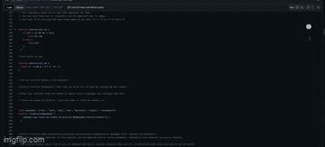

# JavaScript Practice
This is a collection of daily code war challenges I practice with and solve to sharpen my JavaScript skills. 
**Link to project:** https://github.com/ArnauDavis/JavaScriptPractice/blob/main/JavaScriptPractice.js

    

## How It's Made: 

**Tech used:** JavaScript
I will solve a code wars problem, then I upload it to look back at later to see how much I have learned and to maintain a schedule of constantly having to think in JavaScript and solve problems using it.

## Optimizations
This is just a collection of practice problems. Here I do not consider efficiencies, there are some problems I will solve in multiple ways to explore different possibilities, but for the most part, this is me just having fun
and practicing. Having fun with JavaScript, who would have thought huh?

## Lessons Learned

From the start, I can say I think more about the ternary operator when I'm working with simple conditionals. I am still working through when I will need the return keyword and when not to. I also use a lot of 
forEach() and reduce() methods. I've seen some problems where I was able to turn strings into arrays and then vice versa. I'm also practicing coding out loud as well as thinking out pseudocode before I write any code.
Learning to think like a programmer has been a gift all on its own.
